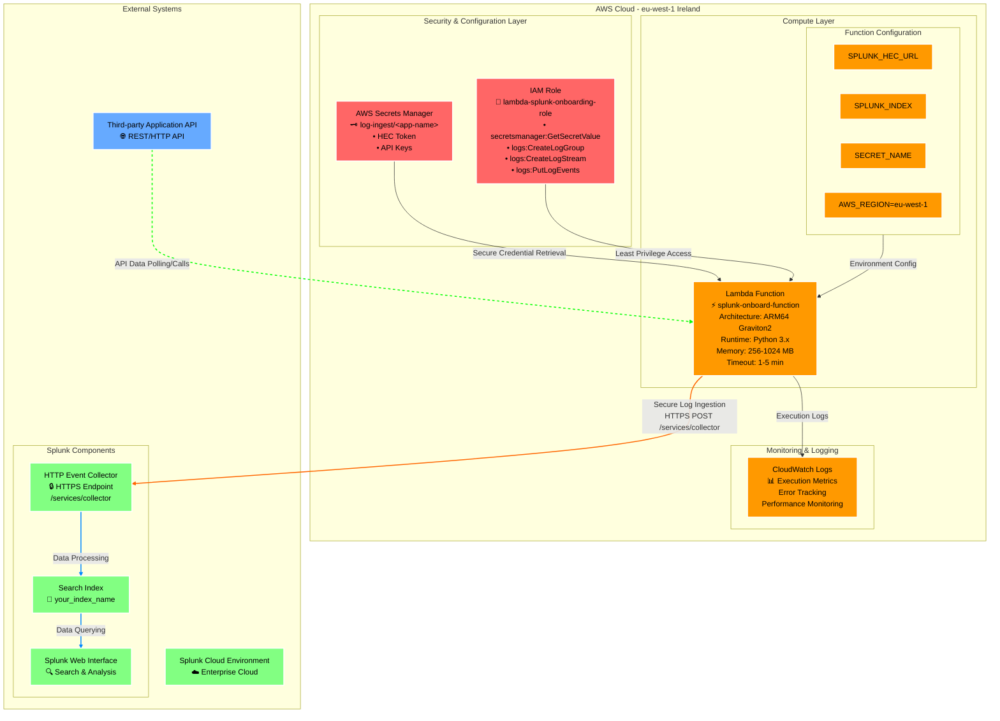
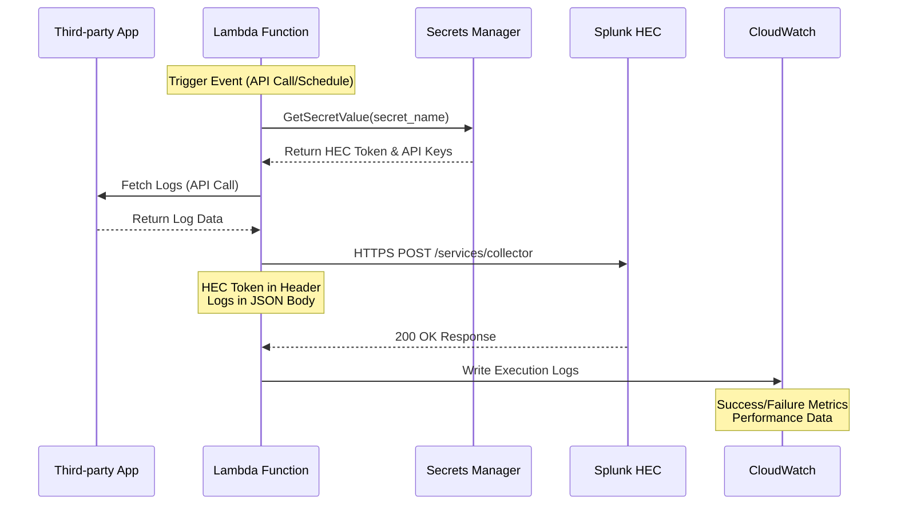

# AWS → Splunk Secure Log Onboarding (Serverless)

## Overview

This repository provides a **step-by-step guide** for securely onboarding third-party application logs into **Splunk Cloud** using **AWS Lambda**.  
The configuration follows best practices for **security**, **cost-efficiency**, and **maintainability**, with all workloads deployed in **eu-west-1 (Ireland)** for optimal pricing and regional compliance.

---

## 🏗️ System Architecture

### Architecture Overview



### Data Flow Sequence



---

## 🧭 Step-by-Step Setup Guide

### Step 1: Region and Architecture

* Use **Region:** `eu-west-1 (Ireland)`  
  → Lower latency and reduced cost for European workloads.
* Choose **Architecture:** `ARM64 (Graviton)`  
  → Offers better runtime performance and cost savings.

---

### Step 2: Create a Secret in AWS Secrets Manager

1. Open **AWS Secrets Manager** → **Store a new secret**.
2. Select **Other type of secret**.
3. Under **Key/value pairs**, add your application's credentials, e.g.:

   ```json
   {
     "hectoken": "REDACTED",
     "app_api_key": "REDACTED"
   }
   ```
4. Set the **Secret name** to something meaningful, e.g.:

   ```
   log-ingest/<application-name>
   ```
5. Add **tags** for context:

   ```
   Owner = YourName
   Environment = Development
   ```
6. Choose **eu-west-1** as the region.
7. Complete the setup and note the **secret name** for later use.

---

### Step 3: Create an IAM Role for Lambda

1. Go to **IAM → Roles → Create role**.
2. Select **Lambda** as the trusted entity.
3. Attach minimal policies that allow:
   * Reading from Secrets Manager.
   * Writing logs to CloudWatch.
4. Name the role, e.g. `lambda-splunk-onboarding-role`.
5. Save it — this role will be linked to your Lambda function later.

---

### Step 4: Create a Lambda Function

1. Navigate to **AWS Lambda → Create function**.
2. Choose **Author from scratch**.
3. Provide:
   * **Name:** `splunk-onboard-function`
   * **Runtime:** `Python 3.x`
   * **Architecture:** `ARM64`
   * **Region:** `eu-west-1`
4. Assign the IAM role created in Step 3.

---

### Step 5: Configure Environment Variables

In your Lambda configuration page, under **Environment variables**, add:

```
SPLUNK_HEC_URL   = https://http-inputs.<your-splunk-cloud>.splunkcloud.com/services/collector
SPLUNK_INDEX     = your_index_name
SECRET_NAME      = log-ingest/<application-name>
AWS_REGION       = eu-west-1
```

These environment variables will be referenced inside the Lambda code.

---

### Step 6: Upload the Lambda Code

1. Copy the prepared Python Lambda code (from your project's `/lambda/` folder).
2. Paste it into the inline code editor in AWS Lambda.
3. Click **Deploy**.
4. Your Lambda is now ready to execute.

---

### Step 7: Test the Lambda Function

1. In AWS Lambda, click **Test** → **Create new test event**.
2. Enter a simple test payload like:

   ```json
   {
     "test": "run"
   }
   ```
3. Run the test.
4. Check **CloudWatch Logs** → confirm `Execution completed successfully` appears.

---

### Step 8: Validate Data in Splunk

1. In **Splunk Cloud**, search for:

   ```spl
   index=<your_index_name>
   ```
2. Confirm logs are appearing from your Lambda function.
3. If data doesn't appear, check:
   * HEC token validity.
   * Network permissions or firewall rules.
   * Lambda logs for timeout or API errors.

---

### Step 9: Ongoing Monitoring

* Review **CloudWatch Logs** regularly for errors or timeouts.
* Rotate API keys or HEC tokens periodically.
* Apply versioning to Lambda functions for rollback capability.

---

## 💡 Why This Setup Works

| Design Aspect             | Benefit                                                |
| ------------------------- | ------------------------------------------------------ |
| **ARM64 (Graviton)**      | Lower cost and higher efficiency for Lambda workloads. |
| **eu-west-1 Region**      | Optimized pricing for EU workloads.                    |
| **Secrets Manager**       | Prevents plaintext credentials exposure.               |
| **Least-privilege IAM**   | Limits access to exactly what Lambda needs.            |
| **Environment Variables** | Keeps non-sensitive configs outside the code.          |
| **Serverless design**     | No need to manage servers — scales automatically.      |

---

## ✅ Testing Checklist

* [ ] Secrets Manager secret created and named correctly.
* [ ] IAM role attached with limited access.
* [ ] Lambda deployed in eu-west-1 (ARM64).
* [ ] Environment variables configured properly.
* [ ] Lambda test run successful with output logged.
* [ ] Data visible in Splunk index.

---

## 📘 Future Enhancements

* Use **EventBridge** to schedule Lambda execution automatically.
* Integrate **Kinesis Firehose** for high-volume streaming.
* Use **PrivateLink (VPC endpoint)** for secure private API access.
* Add checkpointing to handle API pagination.

---

## 🧠 Learning Summary

This guide demonstrates how to:

* Build a secure, serverless data pipeline from AWS → Splunk.
* Store and retrieve secrets safely in AWS Secrets Manager.
* Deploy and test Lambda functions using best practices.
* Follow a structured, auditable setup process aligned with enterprise security standards.
